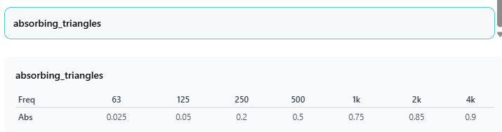
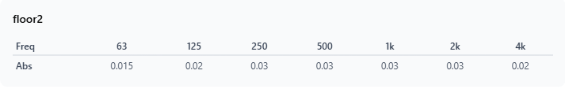
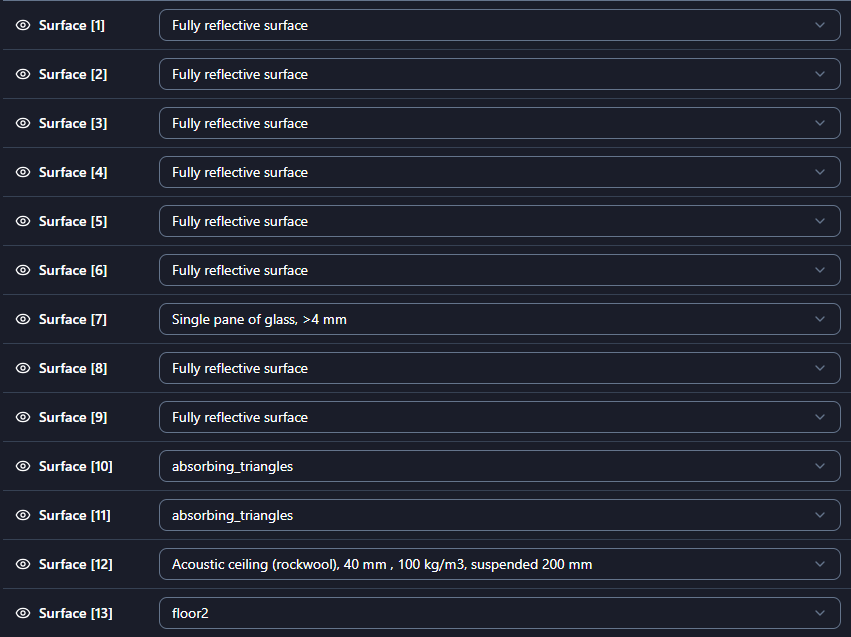

# levelaverlaars

Hello! This is a template repository in which you can upload your deliverables for the CHORAS ASSA Workshop. The deliverables are

1. 🎧 Impulse response from DE (.wav)

2. 📊 T30 results from DE in (.csv)

3. 5️⃣ Frequencies of first 5 modes from DG in (.csv)

4. (Optional) 📊 T30 results from DG (up to the 250Hz band) in (.csv) as calculated with pyfar

5. 📃 This readme filled with the correct information :)

_Feel free to remove this section when you're done :)_

## Members

- Jelle 
- Casper
- (Tim in middag!)

## Process

This is where you can describe how you tackled the task
- (-1) Setup CHORAS (easy!)
- (0) Add geoms to our repo
- (1) Load geom in CHORAS
- Finally we..
- etc.

## Input settings

For reproducibility of your results we would like to know what inputs you used to complete your simulations.

### Geometry

_Room2215_simple_

### Source position

- x: 9
- y: 5
- z: 2

### Receiver position

- x: 2.5
- y: 5
- z: 1.5

### Surfaces

If you created materials you can list them here with their absorption coefficients:





Material properties:



### Settings

You can paste the JSON here by clicking on the Open as JSON button in the Settings tab.

- DE

```json
{
  "sim_len_type": "ir_length",
  "de_ir_length": 1,
  "de_c0": 343,
  "edt": 35,
  "de_lc": 0.05
}```

- DG

```json
<DG settings as JSON>
{
  "dg_freq_upper_limit": 200,
  "dg_c0": 343,
  "dg_rho0": 1.213,
  "dg_ir_length": 1,
  "dg_poly_order": 2,
  "dg_ppw": 6,
  "dg_cfl": 1
}```

## 3 proposals for improving CHORAS

Here you can list your 3 proposals for improving CHORAS. Out of the box ideas are welcome!

- Proposal 1: Uploading geometry is solely an icon without text, we had to guess
- Proposal 2:Support for libre fenix engine based webbrowers that have scrict privacy settings (3D view broken there)
- Proposal 3: More sources (then run parralel for all sources!)
- Proposal 4: Radiation integrals to extrapolate solutions outside boundaries
- Proposal 5: Add 8khz band (at least for material props)
- Proposal 6: make clear what min-max bands we are going to compute in. In csv output they are not shown either
- Proposal 7: CFL conditions to be computed automatically based on time integration scheme, (related to timestep & mesh)
- Proposal 8: Points per lambda to 1/6 wavelength

## Functionality issues

Please list any functionality issues you found:

- Issue 1: window resize closes openend popup windows
- Issue 2: Inconistent in decimating characters (dots, comma's)
- Source of absorbing values. The values of absorbing panels is peculiar (high frequent roll-off).
- Issue 4: If you choose EDT as simulation length, is the energy decay treshold still relevent (or a redundant input?)
- Issue 5: IR length input irrelevant for EDT method
- "Issue 6": When using fully reflective surfaces, low frequent components decay relatively slow, so ensure the simulation time is long enough. 
- Issue 7: Sometimes, the GUI randomly switches solver when editing parameters

## Feedback / experience

Below you can tell us your feedback or describe your experience of working with CHORAS today! Please start every bullet with **I like..** or **I wish/wonder..**

- I like ..
- I wish ..
- I wonder ..
- ..
